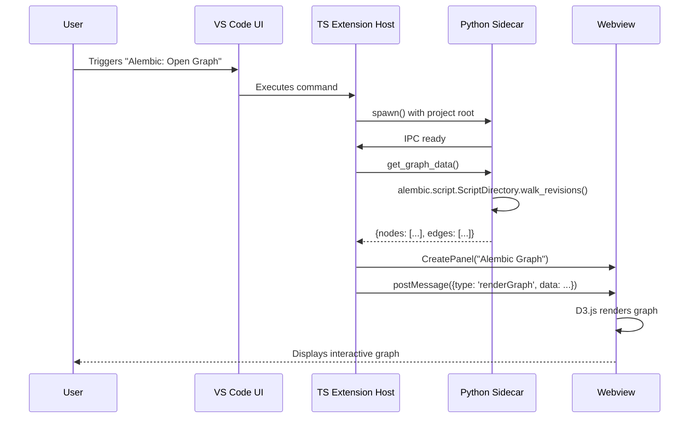

# Alembic Lens - Architecture

This document outlines the high-level architecture for the "Alembic Lens" VS Code extension.

## 1. Overview

Alembic Lens provides developers with tools to visualize and manage their Alembic database migration graphs directly within VS Code. It aims to improve the developer experience by offering an interactive graph, easy access to revision details, and streamlined execution of common Alembic commands.

The extension is composed of three main parts:
*   A **TypeScript extension host** that integrates with the VS Code API.
*   A **Python sidecar process** that interacts with the Alembic library.
*   A **D3.js-powered webview** for rendering the interactive migration graph.


## 2. Sequence Diagram

This diagram shows the typical flow of opening the Alembic graph from the command palette.




## 3. Extension Activation

The extension is activated when a user invokes one of its commands or when the Alembic Lens view is opened.

### `package.json`

```json
{
  "name": "alembic-lens",
  "main": "./out/extension.js",
  "activationEvents": [
    "onCommand:alembicLens.openGraph",
    "onCommand:alembicLens.autoGenerateRevision",
    "onCommand:alembicLens.validateGraph",
    "onView:alembicLens.revisionsView"
  ],
  "contributes": {
    "commands": [
      {
        "command": "alembicLens.openGraph",
        "title": "Alembic: Open Graph"
      },
      {
        "command": "alembicLens.autoGenerateRevision",
        "title": "Alembic: Autogenerate Revision"
      },
      {
        "command": "alembicLens.validateGraph",
        "title": "Alembic: Validate Graph"
      }
    ],
    "views": {
      "explorer": [
        {
          "id": "alembicLens.revisionsView",
          "name": "Alembic Revisions"
        }
      ]
    }
  }
}
```


## 4. Separation of Concerns

### 4.1. TypeScript Host (VS Code Extension)

*   **Responsibilities:**
    *   Manages the extension lifecycle.
    *   Interfaces with the VS Code API (commands, views, notifications, configuration).
    *   Spawns and manages the Python sidecar process.
    *   Acts as a message broker between the webview and the Python sidecar.
    *   Manages webview panels.

### 4.2. Python Sidecar

*   **Responsibilities:**
    *   Exposes a JSON-RPC API over stdio.
    *   Wraps the `alembic` library to safely execute commands (`alembic.command`).
    *   Parses the Alembic revision graph using `alembic.script.ScriptDirectory`.
    *   Serializes Alembic revision data into a JSON-friendly format.
    *   Detects and reports errors from the Alembic library.

### 4.3. Webview

*   **Responsibilities:**
    *   Renders the interactive migration graph using D3.js.
    *   Handles user interactions within the graph (zoom, pan, click).
    *   Displays a diff pane when a revision node is selected.
    *   Communicates with the TS host via `postMessage` API to request data or trigger actions.


## 5. IPC Protocol

Communication between the TypeScript host and the Python sidecar will be handled via JSON-RPC 2.0 over stdio. This approach is simple, efficient, and well-suited for this use case.

*   **Transport:** Standard I/O (`stdin`/`stdout`).
*   **Format:** JSON-RPC 2.0 messages, delimited by newlines.
*   **Library:** [`node-jsonrpc-stdio`](https://www.npmjs.com/package/node-jsonrpc-stdio) for the TS host and a corresponding library like [`python-jsonrpc-server`](https://pypi.org/project/python-jsonrpc-server/) for the Python sidecar.

### Example RPC Methods:

*   `get_graph_data(alembic_root_path: str) -> dict`
*   `autogenerate_revision(alembic_root_path: str, message: str) -> dict`
*   `validate_graph(alembic_root_path: str) -> dict`


## 6. Data Model

The core data model for representing a single revision in the graph is as follows. This structure will be serialized to JSON for IPC.

### Revision Node

```typescript
interface RevisionNode {
  rev_id: string;
  down_revisions: string[];
  message: string;
  upgrade_ops: Operation[];
  downgrade_ops: Operation[];
}

interface Operation {
  type: string; // e.g., 'add_column', 'create_table'
  details: any; // Operation-specific details
}
```


## 7. UX Wireframes

### 7.1. Command Palette

*   **"Alembic: Open Graph"**: Opens the main webview panel with the interactive revision graph.
*   **"Alembic: Autogenerate Revision"**: Prompts the user for a revision message, then runs the `alembic revision --autogenerate` command.
*   **"Alembic: Validate Graph"**: Checks for multiple heads or other graph inconsistencies and reports via a notification.

### 7.2. Side Bar Tree View

*   A tree view in the "Explorer" pane titled "Alembic Revisions".
*   Lists all revisions chronologically, with the most recent at the top.
*   Each item shows the revision ID and the first line of the revision message.
*   Clicking an item opens the corresponding revision file.

### 7.3. Webview Panel

*   A custom editor panel titled "Alembic Graph".
*   **Graph View:**
    *   An interactive, zoomable, and pannable SVG graph rendered with D3.js.
    *   Nodes represent revisions, color-coded by branch. Heads are highlighted.
    *   Edges show dependencies between revisions.
*   **Diff Pane:**
    *   A side panel within the webview.
    *   When a node is clicked, this pane shows a diff of the `upgrade` and `downgrade` operations for that revision.


## 8. Extension Configuration

The following settings will be available in the user's `settings.json` under the `alembicLens` namespace.

*   `alembicLens.pythonPath`: Path to the Python executable. If not set, the extension will try to find a default Python interpreter.
*   `alembicLens.venv`: Path to a virtual environment to use when running the Python sidecar.
*   `alembicLens.autoFixOnSave`: (Future) Automatically run linting and fixing commands on save.


## 9. Error Surfaces & Notifications

*   **Invalid `pythonPath` or `venv`**: The extension will show an error notification with a button to open settings.
*   **Alembic command errors**: Errors from `alembic` (e.g., multiple heads, merge conflicts) will be captured from the Python sidecar's stderr and displayed in an error notification.
*   **IPC Failure**: If the Python sidecar crashes or fails to respond, a "Sidecar process terminated unexpectedly" error will be shown.
*   **Graph Rendering Issues**: Errors in the webview's JavaScript will be logged to the developer console.
